# **HYFIVE(하이파이브)**

### 흩어진 반려동물 건강 기록을 한곳에 모아 AI 리포트로 되돌려주는 통합 관리 앱

FORIF 26-1 기획개발 2팀

<div align="center">


-6DB33F?style=for-the-badge&logo=springboot&logoColor=white>)


</div>

---

## 1. 서비스 개요 및 목적

#### 기획 목적과 서비스 소개

HYFIVE(하이파이브)는 보호자가 반려동물의 진료·식사·산책·건강 기록을 한곳에 모으고, 누적된 데이터를 AI 건강 리포트로 돌려받는 모바일 웹 기반 서비스입니다.

반려동물의 건강 정보는 **출처별로 흩어집니다.** 진료비 영수증은 종이로, 투약·식사·산책은 기억으로, 체중 변화는 어디에도 남지 않습니다. 보호자는 "지난번 그 병원이 얼마였더라", "예방접종이 언제였더라"를 매번 다시 뒤지고, 정작 필요한 순간(다른 병원 방문·보험 청구·이상 징후 판단)에 근거가 될 누적 데이터가 없습니다.

HYFIVE는 이 흩어진 기록을 **하나의 타임라인으로 모읍니다.** 진료 서류는 사진 한 장으로 OCR이 진료일·병원·진단·금액을 자동 추출해 입력 부담을 없애고, 식사·건강·산책은 가벼운 기록 UI로 쌓이며, 누적된 데이터는 건강 리포트와 트렌드 차트로 보호자에게 되돌아옵니다. 핵심은 "기억과 영수증 더미"를 **검색·분석 가능한 건강 자산**으로 바꾸는 것입니다.

#### 타겟층

HYFIVE는 **여러 마리의 반려동물을 키우거나, 진료·생활 기록을 꼼꼼히 관리하고 싶은 보호자**를 주요 타겟으로 합니다.

진료비와 예방접종 이력을 체계적으로 모으고 싶은 보호자, 식사·산책·체중 변화를 추적하고 싶은 보호자, 그리고 흩어진 건강 기록을 하나의 앱에서 통합 관리하고 싶은 사용자에게 적합한 서비스입니다.

> 모바일 웹앱(react-native-webview 탑재 대비)으로 개발되며, 데스크톱 브라우저에서는 iPhone 목 프레임으로 모바일 화면을 확인할 수 있습니다.

---

## 2. 기술 스택

### Frontend

* React 18, TypeScript, Vite 6
* React Router v7, Axios
* Tailwind CSS v4, shadcn/ui

### Backend

* Java 21, Spring Boot 3.5
* Spring Data JPA, Spring Security
* JWT (jjwt), Gradle

### Database

* PostgreSQL

### Storage & OCR

* AWS S3 (진료 이미지 저장)
* Tesseract OCR (tess4j, `kor+eng`)

### Infrastructure

* Frontend: Firebase Hosting
* CI/CD: GitHub Actions
* Mobile: react-native-webview (후속 작업)

---

## 3. API

### 외부 API

* **Google OAuth API** — 소셜 로그인 및 ID 토큰 검증
* **Kakao Maps API** — 산책 실시간 경로 및 지도 표시
* **Geoapify Static Maps API** — 산책 결과 경로 스냅샷 이미지
* **AWS S3** — 진료 영수증 원본 이미지 저장
* **Tesseract OCR** — 진료 서류 텍스트 인식

### 백엔드 API

HYFIVE는 프론트엔드와 백엔드 간 데이터 통신을 위해 REST API 구조를 기반으로 설계하였습니다. 모든 인증 필요 엔드포인트는 `Authorization: Bearer <JWT>` 헤더를 사용합니다.

```
개발 API 서버: http://localhost:8080
```

주요 API 도메인은 다음과 같습니다.

* **인증(auth)** — 이메일/Google 로그인, 회원가입, 토큰 발급·재발급
* **이메일 인증(email)** — 회원가입 6자리 코드 발송 및 검증
* **회원(user)** — 내 개인정보 조회 및 수정
* **반려동물(pet)** — 다중 반려동물 등록·조회·전환
* **진료(medical)** — 진료 기록 조회, 영수증 업로드, OCR 자동 인식
* **식사(meal)** — 끼니/사료/잔반량 기록 및 조회
* **건강(health)** — 체중·음수량·투약·컨디션 기록
* **산책(walk)** — GPS 경로·시간·칼로리 기록
* **이미지(image)** — 기록 사진 업로드 및 관리
* **알림(notification)** — 투약·미기록·예방접종 알림 조회

> 자세한 엔드포인트/스키마는 [`docs/api-spec.md`](docs/api-spec.md) 참고

---

## 4. 주요 기능 소개

#### 1. 로그인 / 회원가입

* 이메일 + 비밀번호 로그인, **Google 계정 로그인**
* 자체 회원가입은 **6자리 코드 이메일 인증**을 거치며, 백엔드 미준비 시 자동 mock 모드로 동작
* 이미 같은 이메일로 가입한 자체 계정이 있으면 소셜 계정을 자동 연결(link)

<table>
  <tr>
    <td>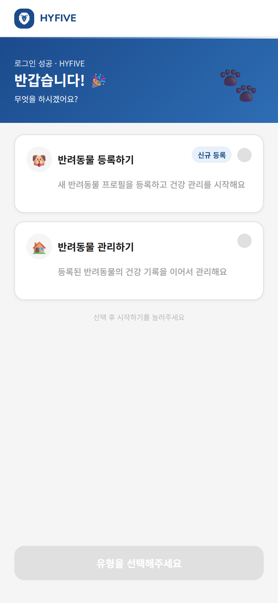</td>
    <td>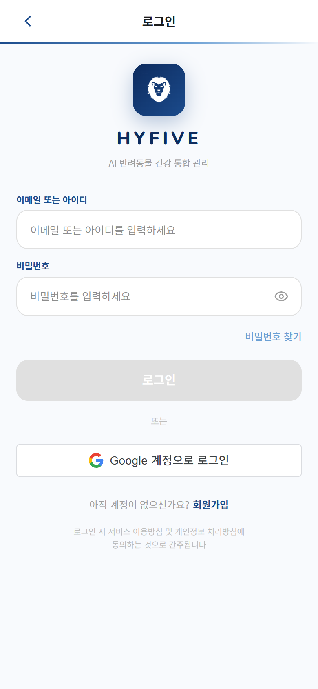</td>
    <td>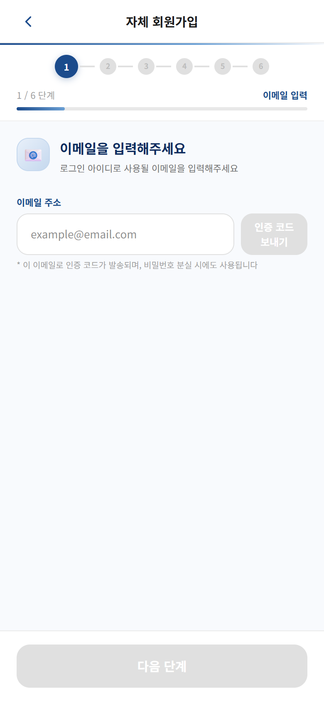</td>
  </tr>
</table>

#### 2. 반려동물 등록 (온보딩)

* 동물 유형·품종·생일·성별·중성화·사진 등 프로필 등록
* 한 보호자가 **여러 반려동물을 등록·전환**하며 각 개체별로 기록을 누적

<table>
  <tr>
    <td>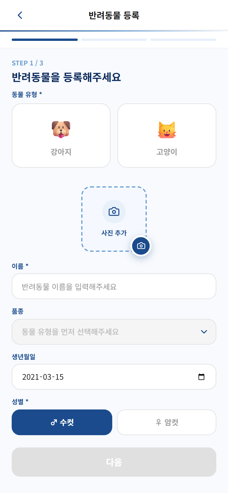</td>
    <td>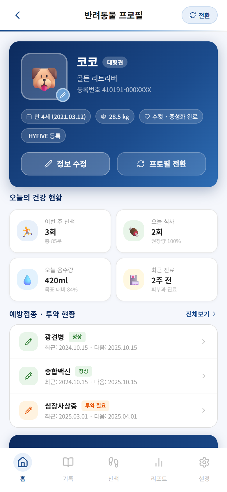</td>
  </tr>
</table>

#### 3. 홈 대시보드 & 알림

* 반려동물 요약, 오늘의 알림, 빠른 기록, 최근 기록을 한 화면에서 확인
* 투약일·미기록·예방접종 등 보호자가 놓치기 쉬운 일정을 알림 카드로 제공

<table>
  <tr>
    <td>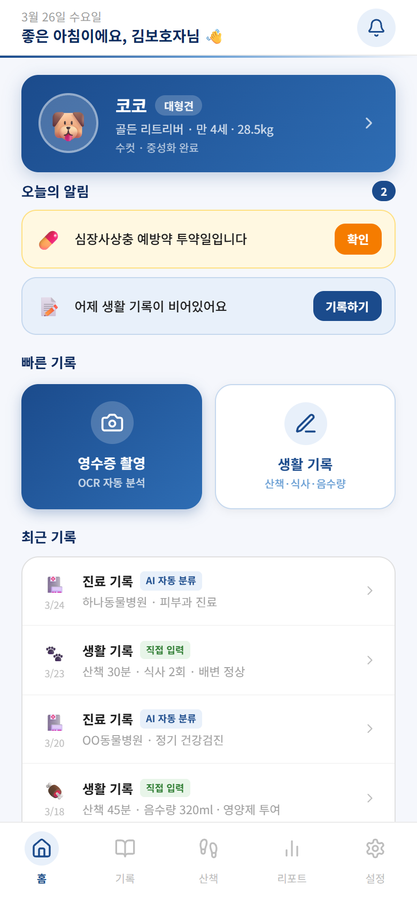</td>
    <td>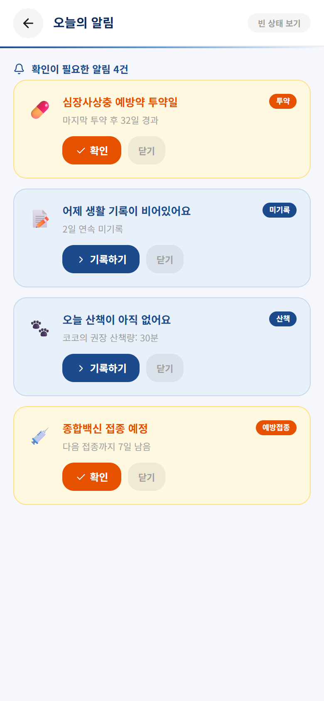</td>
  </tr>
</table>

#### 4. 진료 영수증 OCR 자동 인식

* 진료 서류 사진을 업로드하면 **이미지 전처리(업스케일·그레이스케일·Otsu 이진화) → Tesseract 인식 → 필드 파싱** 파이프라인으로 진료일·병원명·진단명·진료내용·총액을 자동 추출
* 진료유형(검진·예방접종·수술·일반진료)을 키워드 사전으로 자동 분류
* 추출 결과는 보호자가 직접 확인·수정 후 저장

<table>
  <tr>
    <td>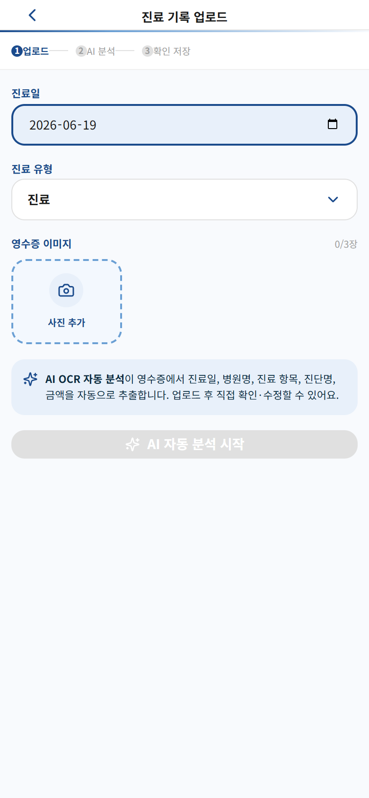</td>
  </tr>
</table>

#### 5. 생활 기록 (식사 · 건강 · 산책)

* 식사(끼니/사료 종류/급여량/잔반량), 건강(체중·음수량·투약·컨디션)을 가벼운 UI로 기록
* 카테고리별 오늘의 달성률과 기록 현황을 한눈에 확인

<table>
  <tr>
    <td>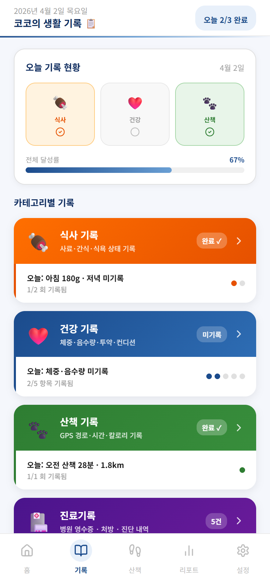</td>
    <td>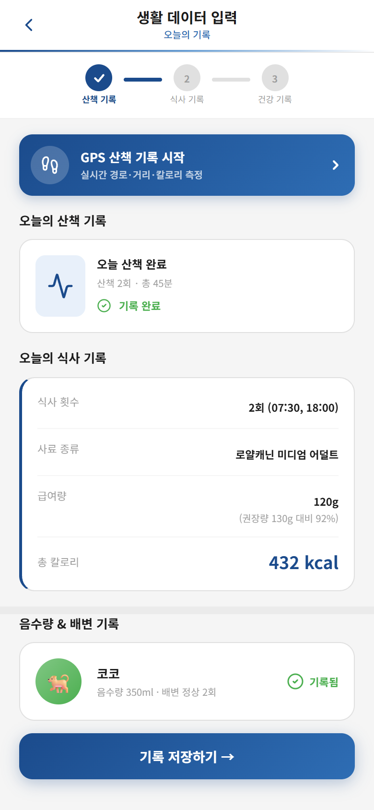</td>
  </tr>
</table>

#### 6. 산책 GPS 기록

* Kakao Maps 기반 실시간 경로 표시, 산책 시간·거리·칼로리 측정
* 산책 종료 시 경로 스냅샷과 함께 기록 저장

<table>
  <tr>
    <td>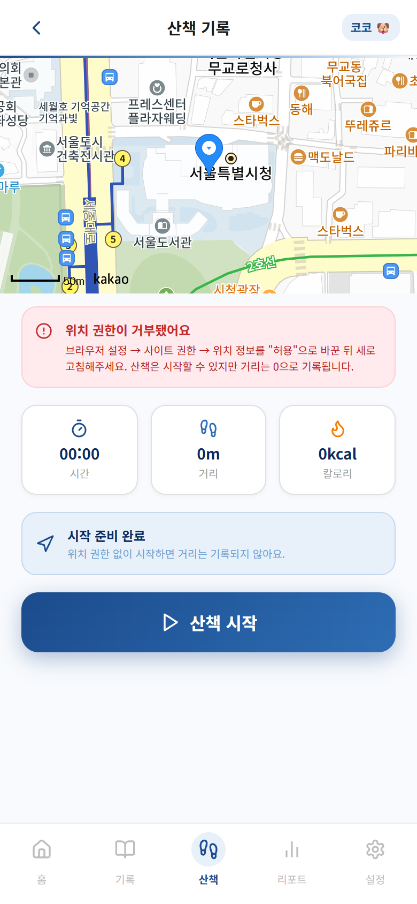</td>
  </tr>
</table>

#### 7. 건강 리포트 & 트렌드

* 누적된 진료·생활 데이터를 **건강 리포트와 트렌드 차트**로 시각화
* 최근 3개월 진료 현황, 주간 생활 기록, 산책 시간 추이, 소형견 평균 대비 비교 등 제공

<table>
  <tr>
    <td>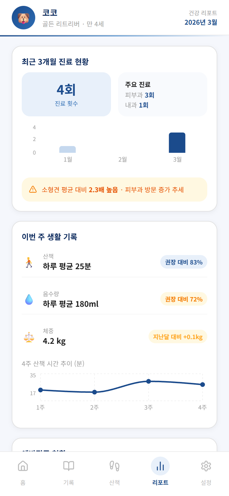</td>
    <td>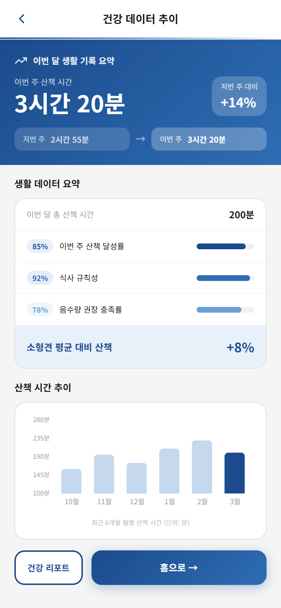</td>
  </tr>
</table>

#### 8. 설정

* 개인정보 수정, 비밀번호 찾기, 프로필 전환/수정
* 미기록·산책·투약·예방접종 알림 on/off 설정

<table>
  <tr>
    <td>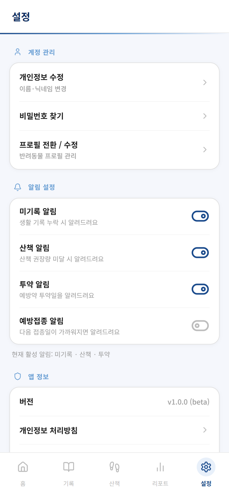</td>
  </tr>
</table>

---

## 5. 기술적 의사결정

| 결정        | 선택                                               | 왜                                                                             |
| ----------- | -------------------------------------------------- | ------------------------------------------------------------------------------ |
| OCR         | **Tesseract + 자체 전처리** (Otsu 이진화·업스케일) | 외부 OCR API 비용·의존성 없이 영수증 인식률 확보, 전처리로 저품질 촬영본 보완  |
| 인증        | **JWT (access) + Refresh(SHA-256 해시 저장)**      | access는 stateless 검증, refresh는 해시 저장으로 DB 유출 시에도 원문 토큰 보호 |
| 소셜 로그인 | **Google OAuth + 이메일 기준 계정 연결**           | 가입 수단이 달라도 동일 이메일이면 한 계정으로 통합, 계정 분기 방지            |
| 이메일 인증 | **프론트 mock 폴백 + 계약(API 시그니처) 우선**     | 백엔드 메일 인프라와 독립적으로 프론트 개발·검증 진행, env 전환만으로 실 연동  |
| 모바일 전략 | **react-native-webview 대비 웹앱**                 | 단일 웹 코드베이스 유지, `VITE_USE_MOBILE_FRAME`으로 데스크톱 미리보기         |
| 배포        | **Firebase Hosting + GitHub Actions**              | `frontend/**` 변경 시 CI(검증)·CD(배포) 자동화, 학생 프로젝트 운영 부담 최소화 |

---

## 6. 개발 시작

### Frontend

```bash
cd frontend
npm install
npm run dev        # http://localhost:5173
```

환경변수: `frontend/.env.example` 참고

* `VITE_USE_MOBILE_FRAME=true` — 데스크톱 브라우저에서 iPhone 목 프레임 표시
* `VITE_USE_MOBILE_FRAME=false` — react-native-webview 배포 시 풀스크린 모드
* `VITE_API_BASE_URL` 미설정 시 이메일 인증은 자동 mock 모드(코드 `123456`)로 동작

### Backend

```bash
cd backend
./gradlew bootRun
```

### CI/CD

| 워크플로우        | 트리거                               | 역할                          |
| ----------------- | ------------------------------------ | ----------------------------- |
| `frontend-ci.yml` | PR → main (`frontend/**` 변경 시)    | typecheck + lint + build 검증 |
| `frontend-cd.yml` | push to main (`frontend/**` 변경 시) | Firebase Hosting 자동 배포    |

---

## 문서 (SSOT)

[`docs/PRD.md`](docs/PRD.md) · [`docs/api-spec.md`](docs/api-spec.md) · [`docs/ARCHITECTURE.md`](docs/ARCHITECTURE.md) · [`docs/CICD_SETUP.md`](docs/CICD_SETUP.md) · [`DESIGN.md`](DESIGN.md) · [`docs/plans/`](docs/plans/)

## 라이선스

shadcn/ui components: MIT License · Unsplash photos: Unsplash License
</content>
